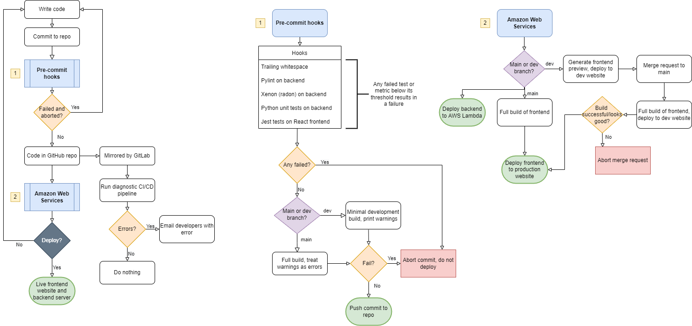

# Online Interactive Evolutionary Art
*Project by Jackson Dean for UVM CS 205*

# CI/CD Pipeline
- Two branches: main and development
- Githooks prevent broken code from being pushed to main
    - Both warnings and errors cause hooks to fail on main branch
    - Only errors cause hooks to fail on development branch
    - Commits on development branch trigger tests
    - Commits on main branch trigger both build and tests
- Main branch is periodically rebased with development branch
- Mirroring repository from GitHub to GitLab
- GitLab runs CI/CD pipeline with build and tests, emails on failure

## Front-end
- Pre-commit hook checks for code complexity using xenon (built on radon) and fails if complexity rating is worse than B (absolute) A (modules) or A (average)
- Pre-commit hook checks for code quality using pylint and fails if complexity rating is worse 8.0
- Amazon Web Services (AWS) Amplify pulls from GitHub repo
- AWS builds and deploys repo (main branch)
- Pull requests on main trigger a preview build on AWS

## Back-end
- GitHub Action pushes changes to the python server code to AWS

